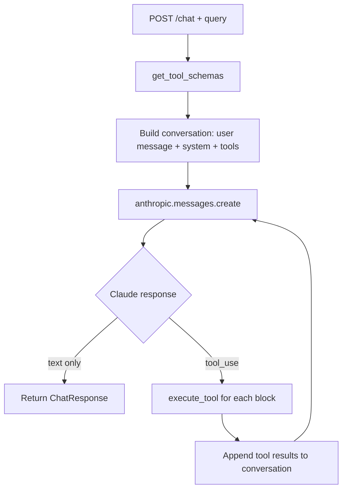

# /chat endpoint – how tools are chosen (simple flow)

## High-level flow

```
┌─────────────┐     POST /chat      ┌─────────────┐
│   Client    │ ──────────────────► │   FastAPI   │
│  (query)    │                     │   app.py    │
└─────────────┘                     └──────┬──────┘
                                           │
                                           ▼
                                    ┌─────────────┐
                                    │ get_tool_   │
                                    │ schemas()   │  ← All 15 tools (find_node, count_*, run_query, ...)
                                    └──────┬──────┘
                                           │
                                           ▼
┌─────────────┐   system + tools     ┌─────────────┐
│   Claude    │ ◄────────────────── │ anthropic.  │
│   (LLM)     │   + user query      │ messages.   │
│             │                     │ create()   │
└──────┬──────┘                     └──────┬──────┘
       │                                   │
       │  response: text and/or tool_use    │
       └──────────────────────────────────┘
                       │
           ┌───────────┴───────────┐
           ▼                       ▼
    [ text only ]           [ tool_use blocks ]
    → return answer         → execute_tool(name, input)
                                     │
                                     ▼
                            TOOL_REGISTRY[name](**input)
                            (e.g. run_query, find_node, …)
                                     │
                                     ▼
                            Append tool results to conversation
                            → loop: call Claude again with results
                            → Claude returns text answer or more tools
                                     │
                                     ▼
                            Return ChatResponse(response=..., tool_calls=...)
```

## Step-by-step (simple)

1. **Request**  
   Client sends `POST /chat` with `{ "query": "How many assets in Biofilter 11?" }`.

2. **Tools prepared**  
   `get_tool_schemas()` builds the list of 15 tools (from `TOOL_REGISTRY`) and their JSON schemas.

3. **First LLM call**  
   Claude receives:
   - **system**: Instructions + short description of each tool and when to use it.
   - **messages**: `[{ "role": "user", "content": "<query>" }]`.
   - **tools**: The 15 tool schemas.

4. **LLM decides**  
   Claude’s response is one of:
   - **Text only** → Treated as final answer; return it and stop.
   - **Tool use** → One or more `tool_use` blocks (e.g. `count_related_by_name`, `find_node`, `run_query`).

5. **Execute tools**  
   For each `tool_use` block:
   - `execute_tool(tool_use.name, tool_use.input)` is called.
   - This runs `TOOL_REGISTRY[tool_name](**input)` (e.g. `count_related_by_name(name="Biofilter 11", ...)`).

6. **Loop (if tools were used)**  
   Tool results are appended to the conversation and Claude is called again. It can:
   - Return a **text** answer (done), or
   - Return **more tool_use** (e.g. follow-up with `list_related`).

7. **Stop when**  
   - Claude returns text and no tool_use, or  
   - No tool_use in the response, or  
   - Max iterations (5) reached → one last LLM call to get a final answer.

## Who chooses the tools?

**The LLM (Claude)** chooses. There is no app logic that maps the query to a specific tool. The system prompt describes each tool and when to prefer it (e.g. “use count_related_by_name for how many entities in X”, “use run_query only when domain tools cannot answer”). Claude picks tool name and arguments from that.

## Tool list (from TOOL_REGISTRY)

| Tool | Typical use |
|------|------------------|
| find_node | Get node(s) by name → node_id for other tools |
| count_nodes | “Do we have any X?” (count by name) |
| count_by_label | Total count for a label (e.g. Asset) |
| list_categories | Category hierarchy |
| get_node_connections | How a node is connected (in/out edges) |
| count_by_category | Counts per category (location/system) |
| count_related | Count related to one node (by node_id) |
| count_related_by_name | “How many entities in X?” (e.g. assets in Biofilter 11) |
| list_related | List related to one node (by node_id) |
| list_related_by_name | “List assets in X” |
| count_breakdown | Full breakdown (Location, System, Context) |
| get_schema | Labels, relationship types, property keys |
| run_query | Custom read-only Cypher when other tools are not enough |

## Mermaid diagram (for renderers that support it)


